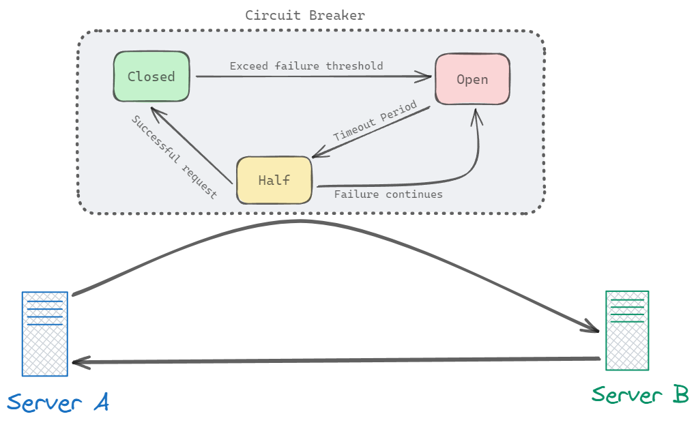

# circuit-breaker-nodejs (ES)

El patrón *circuit breaker* permite controlar cuando ocurren fallas simultáneas en un servicio. Por ejemplo, imagine que el servicio A intenta comunicarse repetidamente con el servicio B, que no está disponible debido a latencia o falla. En tal escenario, *circuit breaker* cortará la comunicación con el servicio B. Después de un tiempo de espera, algunas solicitudes podrán llegar al servicio B nuevamente. Si el servicio B responde correctamente, se restablecerá el funcionamiento normal.

### Descripción
Implementar el patron ***circuit breaker*** en NodeJS por medio de la simulación de dos servidores (A y B). El servidor A tendrá una comunicación con el servidor B (respondiendo solamente con un *"Hello From Server B"*). En el momento de presentar un fallo en el servidor B, el servidor A, que tiene implementado el patron ***circuit breaker***, pasará al estado abierto, denegando cualquier solicitud al servidor B. Después de un tiempo de espera, el estado del circuito pasará a ser semiabierto, realizando ocasionalmente solicitudes al servidor B para comprobar si vuelve a estar en funcionamiento. Si el servidor B vuelva a estar activo, el estado del circuito pasará a ser cerrado y la comunicación volverá a funcionar normalmente.

### Objetivos
- Examinar el comportamiento del patron *circuit breaker*.
- Verificar los cambios de estado del patron *circuit breaker*.
- Implementar el patron *circuit breaker* haciendo uso de **NodeJS**.

### Tecnologías usadas
- **Javascript**: como lenguaje de programación.
- **NodeJS**: como entorno de ejecución.
- **Express**: como framework de backend e implementación de APIs.
- **Axios**: como cliente HTTP.

### Resultados

1. Estado inicial:
   - Servidor A envía solicitudes a Servidor B.
   - Servidor B responde con "Hello From Server B".

2. Falla en Servidor B:
   - Simulamos una falla en Servidor B, para esto desactivamos la ejecución del servidor.
   - Servidor A detecta la falla y entra en estado abierto.
   - Todas las solicitudes a Servidor B son denegadas por el servidor A.

3. Periodo de espera:
   - Servidor A espera un tiempo determinado antes de probar nuevamente la comunicación.
   - El estado del circuito cambia a semiabierto.
   - Servidor A envía solicitudes ocasionales a Servidor B para verificar si está activo.

4. Restablecimiento de Servidor B:
   - Servidor B vuelve a estar activo, reactivamos la ejecución del servidor.
   - Servidor A detecta la respuesta exitosa de Servidor B.
   - El estado del circuito cambia a cerrado.
   - La comunicación entre Servidor A y Servidor B se restablece y funciona normalmente.

### Conclusiones

Este proyecto demuestra la implementación efectiva del patrón circuit breaker, gestionando fallos de servicios y manteniendo la estabilidad del sistema mediante la gestión de estados del circuito.

---

# circuit-breaker-nodejs (EN)

The circuit breaker is a pattern that allows control when simultaneous failures occur in a service. For instance, imagine service A repeatedly attempting to communicate with service B, which is unavailable due to latency or failure. In such a scenario, the circuit breaker will cut off communication with service B. After a timeout period, some requests will be allowed to reach service B again. If service B responds correctly, normal operation will resume.

### Description
Implement the ***circuit breaker*** pattern in Node.js by simulating two servers (A and B). Server A will communicate with Server B, which responds only with "Hello From Server B". When a failure occurs on Server B, Server A, which has the ***circuit breaker*** pattern implemented, will enter the open state, denying any requests to Server B. After a timeout, the circuit state will change to semi-open, occasionally making requests to Server B to check if it is back up and running. If Server B becomes active again, the circuit state will change to closed, and communication will resume as normal.

### Objectives
- Examine the behavior of the *circuit breaker* pattern.
- Verify the state changes of the *circuit breaker* pattern.
- Implement the *circuit breaker* pattern using **NodeJS**.

### Technologies
- **Javascript**: as a programming language.
- **NodeJS**: as execution environment.
- **Express**: as a backend framework and API implementation.
- **Axios**: as HTTP client.

### Results

1. Initial State:
   - Server A sends requests to Server B.
   - Server B responds with "Hello From Server B".

2. Failure in Server B:
   - We simulate a failure on Server B, for this we deactivate the execution of the server.
   - Server A detects the failure and enters the open state.
   - All requests to Server B are denied by Server A.

3. Timeout Period:
   - Server A waits a certain time before trying communication again..
   - The circuit status changes to semi-open.
   - Server A sends occasional requests to Server B to check if it is active.

4. Server B Reset:
   - Server B is active again, we reactivate the server execution.
   - Server A detects the successful response from Server B.
   - The circuit status changes to closed.
   - Communication between Server A and Server B is restored and works normally.

### Conclusions
This project effectively demonstrates the implementation of the circuit breaker pattern, managing service failures and maintaining system stability through precise circuit state management.